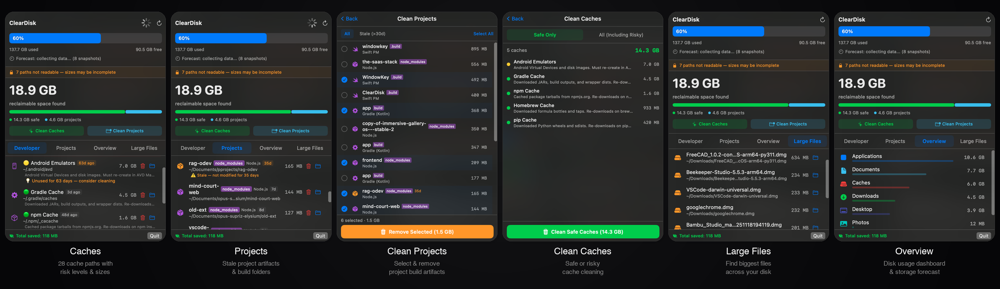

# ClearDisk

**Your Mac is hiding 50–500 GB of developer caches. ClearDisk finds them in seconds.**

A free, open-source macOS menu bar app that monitors and cleans developer caches — Xcode, npm, Homebrew, Docker, pip, Cargo, Go, Gradle, and more. 590 KB. Zero dependencies. No data collection. No analytics. No network access. Ever.


<p align="center">
  
</p>

---

## Why ClearDisk?

Your Mac's SSD is full of developer caches you forgot about. Xcode DerivedData alone can eat 200 GB. Add npm, Homebrew, Docker, pip, and Cargo — and you're losing hundreds of gigabytes to files that can be safely rebuilt.

**Existing tools don't solve this:**
- **DaisyDisk** ($10) — shows what's big, but doesn't know what's *safe to delete*
- **DevCleaner for Xcode** (1,500 ⭐) — only cleans Xcode. Ignores npm, pip, brew, Docker, Go, Cargo, Gradle
- **CleanMyMac** ($40/yr) — bloated, expensive, trust issues
- **SquirrelDisk** — dead (3 years, no updates)

ClearDisk scans **28 developer cache paths** in one tool. Lives in your menu bar. Alerts you when disk gets full.

## Features

- **28 Developer Caches** — Xcode (DerivedData, Archives, Simulators, Caches, Device Support, Logs, Previews), Swift PM, CocoaPods, Carthage, Homebrew, npm, Yarn, pnpm, Bun, pip, Conda, Gradle, Maven, Docker, Composer, Go, Rust Cargo, Flutter/Pub, JetBrains, Ruby Gems, Android Emulators
- **Project Artifact Scanner** — Finds stale `node_modules`, `target/`, `.build/`, `build/`, `vendor/` in your project folders. Detects 11 project types (Node.js, Rust, Swift, Go, Gradle, Maven, PHP, Ruby, Flutter, CMake)
- **Cache Descriptions** — Every cache shows a human-readable explanation ("Downloaded Swift packages. Re-downloads on next build.") so you know exactly what you're deleting
- **DerivedData Project Breakdown** — Shows which projects live inside DerivedData (e.g. "MyApp: 2.3 GB, OtherApp: 1.1 GB") by reading `info.plist`
- **Hero Dashboard** — Big, clear display of total cleanable space with breakdown by dev caches and trash
- **Menu Bar Monitor** — Always-on disk usage display. Changes color at 80%/90% thresholds. Shows cleanable amount when disk is stressed
- **Risk Levels** — 🟢 Safe (rebuilds with a command), 🟡 Caution (large re-download needed), 🔴 Risky (may contain irreplaceable data)
- **Xcode Running Check** — Warns you if Xcode is running when you try to clean Xcode-related caches
- **Safe Delete** — Files go to Trash, not permanent delete. You can always recover
- **Visual Category Bars** — Color-coded proportional bars showing what's eating your disk
- **Recovery Tracking** — "Recovered 12.4 GB!" banner after cleanup + cumulative "Total saved: 123 GB" counter
- **Storage Forecast** — Predicts when your disk will be full based on usage trends (linear regression, 90-day history)
- **Smart Suggestions** — Age-based recommendations ("Not used for 90 days — safe to clean")
- **Smart Notifications** — Alerts at 80% and 90% disk usage, no spam
- **100% Private** — No data collection. No analytics. No network access. Source code is open — verify yourself

## Comparison

| Feature | ClearDisk | DevCleaner | npkill | kondo | mac-cleanup | DaisyDisk | CleanMyMac |
|---------|-----------|------------|--------|-------|-------------|-----------|------------|
| Native macOS GUI | ✅ | ✅ | ❌ CLI | ❌ CLI | ❌ CLI | ✅ | ✅ |
| Menu bar monitor | ✅ | ❌ | ❌ | ❌ | ❌ | ❌ | ❌ |
| Xcode cleanup | ✅ 9 paths | ✅ 6 paths | ✅ | ✅ | ✅ | ❌ | ✅ |
| npm/pip/brew/go/cargo | ✅ | ❌ | Partial | ❌ | ✅ | ❌ | Partial |
| Docker/Gradle/Maven | ✅ | ❌ | ❌ | ❌ | Partial | ❌ | ❌ |
| Risk levels | ✅ | ❌ | ❌ | ❌ | ❌ | ❌ | ❌ |
| Cache descriptions | ✅ | ❌ | ✅ | ❌ | ❌ | ❌ | ❌ |
| Storage forecast | ✅ | ❌ | ❌ | ❌ | ❌ | ❌ | ❌ |
| Safe delete (Trash) | ✅ | ❌ `removeItem` | ❌ `rm -rf` | ❌ `rm -rf` | ❌ `rm -rf` | N/A | ❌ |
| Total cache paths | 28 | 6 | 50+ | 24 types | 42 modules | 0 | Unknown |
| Price | Free | Free | Free | Free | Free | $10 | $40/yr |
| Open source | ✅ MIT | ✅ GPL-3 | ✅ MIT | ✅ MIT | ✅ Apache-2 | ❌ | ❌ |

## Installation

### Download DMG (Easiest)

1. Download the latest DMG from [**Releases**](https://github.com/bysiber/cleardisk/releases/latest)
2. Open the DMG and drag ClearDisk to Applications
3. Run `xattr -cr /Applications/ClearDisk.app` in Terminal
4. Open ClearDisk from Applications

### Build from Source

```bash
git clone https://github.com/bysiber/cleardisk.git
cd cleardisk
bash build_app.sh
cp -R ClearDisk.app /Applications/
xattr -cr /Applications/ClearDisk.app
open /Applications/ClearDisk.app
```

That's it. Click the disk icon in your menu bar.

> **Why `xattr -cr`?** ClearDisk is not code-signed ($99/yr Apple Developer fee). This removes the macOS Gatekeeper quarantine flag. You can verify every line of source code yourself — it's fully open.
> 
> Homebrew Cask install coming soon: `brew install --cask cleardisk`

Requires macOS 14+ (Apple Silicon). Xcode Command Line Tools needed for building from source (`xcode-select --install`).

## How It Works

ClearDisk scans **known developer cache directories** on a 5-minute interval:

```
~/Library/Developer/Xcode/DerivedData           → 🟢 Safe
~/Library/Developer/Xcode/Archives              → 🟡 Caution
~/Library/Developer/CoreSimulator/Devices        → 🟡 Caution
~/Library/Developer/Xcode/Products              → 🟢 Safe
~/Library/Developer/Xcode/iOS DeviceSupport     → 🟢 Safe
~/Library/Logs/CoreSimulator                    → 🟢 Safe
~/Library/Developer/Xcode/UserData/Previews     → 🟢 Safe
~/Library/Developer/CoreSimulator/Caches        → 🟢 Safe
~/Library/Caches/org.swift.swiftpm              → 🟢 Safe
~/Library/Caches/CocoaPods                      → 🟢 Safe
~/Library/Caches/Homebrew                       → 🟢 Safe
~/.npm/_cacache                                 → 🟢 Safe
~/Library/pnpm/store                            → 🟢 Safe
~/.bun/install/cache                            → 🟢 Safe
~/Library/Caches/pip                            → 🟢 Safe
~/.conda/pkgs                                   → 🟢 Safe
~/.gradle/caches                                → 🟢 Safe
~/.m2/repository                                → 🟢 Safe
~/.android/avd                                  → 🟡 Caution
~/Library/Containers/com.docker.docker          → 🔴 Risky
~/.pub-cache                                    → 🟢 Safe
~/.cache/JetBrains                              → 🟢 Safe
~/.gem                                          → 🟢 Safe
...and 5 more
```

It only looks at these specific paths — no full disk scan, no file indexing, no background processes.

When you clean, files are **moved to Trash** (not permanently deleted). You can recover them anytime before emptying Trash.

## Privacy & Trust

- **Zero network access** — the app never connects to the internet
- **Zero telemetry** — no analytics, no crash reports, no usage data
- **Zero background processes** — only scans when the popover is open or on a 5-min timer
- **Open source** — read every line of code yourself
- **Safe delete** — everything goes to Trash first

## Tech Stack

- Swift + SwiftUI
- macOS 14+ (Sonoma)
- SPM (Swift Package Manager)
- No external dependencies
- ~1,500 lines of code total

## Contributing

Issues and PRs welcome. See [CONTRIBUTING.md](CONTRIBUTING.md) for details.

## License

[MIT](LICENSE) — Kadir Can Ozden
