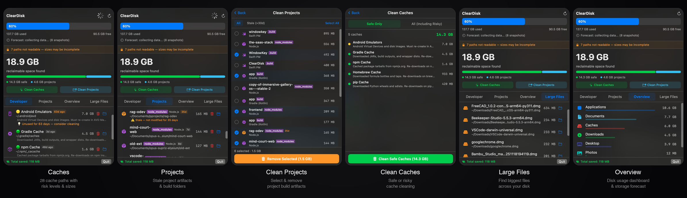

# ClearDisk

<p align="center">
  
</p>

**Your Mac is hiding 50–500 GB of developer caches. ClearDisk finds them in seconds.**

A free, open-source macOS menu bar app that monitors and cleans developer caches, Xcode, npm, Homebrew, Docker, pip, Cargo, Go, Gradle, and more. 590 KB. Zero dependencies. No data collection. No analytics. No network access. Ever.


[](https://github.com/bysiber/cleardisk/stargazers)
[](https://github.com/bysiber/cleardisk/releases/latest)
[](https://github.com/bysiber/homebrew-cleardisk)

<p align="center">
  
</p>

---

## Why ClearDisk?

Your Mac's SSD is full of developer caches you forgot about. Xcode DerivedData alone can eat 200 GB. Add npm, Homebrew, Docker, pip, and Cargo — and you're losing hundreds of gigabytes to files that can be safely rebuilt.

**Existing tools don't solve this:**
- **DaisyDisk** ($10) — shows what's big, but doesn't know what's *safe to delete*
- **DevCleaner for Xcode** (1,500 ⭐) — only cleans Xcode. Ignores npm, pip, brew, Docker, Go, Cargo, Gradle
- **CleanMyMac** ($40/yr) — bloated, expensive, trust issues
- **SquirrelDisk** — dead (3 years, no updates)

ClearDisk scans **50 developer cache paths** in one tool. Lives in your menu bar. Alerts you when disk gets full.

## Features

- **50 Developer Caches** — Xcode (DerivedData, Archives, Simulators, Caches, Device Support, Logs, Previews), Swift PM, CocoaPods, Carthage, Homebrew, npm, Yarn, pnpm, Bun, Deno, pip, UV, Conda, Gradle, Maven, Docker, Terraform, Composer, Go, Rust Cargo, Flutter/Pub, JetBrains, Ruby (Gems, rbenv, mise, RVM, Bundler), Android Emulators, Testing (Playwright, Puppeteer, Prisma), AI Tools (Claude Desktop, Claude Code, Ollama, HuggingFace, ChatGPT, Cursor, Windsurf), VS Code (Cache, CachedData, Extensions, Chromium Cache, Logs)
- **Project Artifact Scanner** — Finds stale `node_modules`, `target/`, `.build/`, `build/`, `vendor/` in your project folders. Detects 11 project types (Node.js, Rust, Swift, Go, Gradle, Maven, PHP, Ruby, Flutter, CMake)
- **Cache Descriptions** — Every cache shows a human-readable explanation ("Downloaded Swift packages. Re-downloads on next build.") so you know exactly what you're deleting
- **DerivedData Project Breakdown** — Shows which projects live inside DerivedData (e.g. "MyApp: 2.3 GB, OtherApp: 1.1 GB") by reading `info.plist`
- **Hero Dashboard** — Big, clear display of total cleanable space with breakdown by dev caches and trash
- **Menu Bar Monitor** — Always-on disk usage display. Changes color at 80%/90% thresholds. Shows cleanable amount when disk is stressed
- **Risk Levels** — 🟢 Safe (rebuilds with a command), 🟡 Caution (large re-download needed), 🔴 Risky (may contain irreplaceable data)
- **Xcode Running Check** — Warns you if Xcode is running when you try to clean Xcode-related caches
- **Safe Delete** — Files go to Trash, not permanent delete. You can always recover
- **Visual Category Bars** — Color-coded proportional bars showing what's eating your disk
- **Recovery Tracking** — "Recovered 12.4 GB!" banner after cleanup + cumulative "Total saved: 123 GB" counter
- **Storage Forecast** — Predicts when your disk will be full based on usage trends (linear regression, 90-day history)
- **Smart Suggestions** — Age-based recommendations ("Not used for 90 days — safe to clean")
- **Smart Notifications** — Alerts at 80% and 90% disk usage, no spam
- **100% Private** — No data collection. No analytics. No network access. Source code is open — verify yourself

## Comparison

| Feature | ClearDisk | DevCleaner | npkill | kondo | mac-cleanup | DaisyDisk | CleanMyMac |
|---------|-----------|------------|--------|-------|-------------|-----------|------------|
| Native macOS GUI | ✅ | ✅ | ❌ CLI | ❌ CLI | ❌ CLI | ✅ | ✅ |
| Menu bar monitor | ✅ | ❌ | ❌ | ❌ | ❌ | ❌ | ❌ |
| Xcode cleanup | ✅ 9 paths | ✅ 6 paths | ✅ | ✅ | ✅ | ❌ | ✅ |
| npm/pip/brew/go/cargo | ✅ | ❌ | Partial | ❌ | ✅ | ❌ | Partial |
| Docker/Gradle/Maven | ✅ | ❌ | ❌ | ❌ | Partial | ❌ | ❌ |
| Risk levels | ✅ | ❌ | ❌ | ❌ | ❌ | ❌ | ❌ |
| Cache descriptions | ✅ | ❌ | ✅ | ❌ | ❌ | ❌ | ❌ |
| Storage forecast | ✅ | ❌ | ❌ | ❌ | ❌ | ❌ | ❌ |
| Safe delete (Trash) | ✅ | ❌ `removeItem` | ❌ `rm -rf` | ❌ `rm -rf` | ❌ `rm -rf` | N/A | ❌ |
| Total cache paths | 50 | 6 | 50+ | 24 types | 42 modules | 0 | Unknown |
| Price | Free | Free | Free | Free | Free | $10 | $40/yr |
| Open source | ✅ MIT | ✅ GPL-3 | ✅ MIT | ✅ MIT | ✅ Apache-2 | ❌ | ❌ |

## Installation

### Homebrew (Easiest)

```bash
brew tap bysiber/cleardisk
brew install --cask cleardisk
```

That's it. Homebrew handles everything, including the quarantine flag.

### Download DMG

1. Download the latest DMG from [**Releases**](https://github.com/bysiber/cleardisk/releases/latest)
2. Open the DMG and drag ClearDisk to Applications
3. **First launch:** macOS will block it because it's not notarized. Choose one:
   - **GUI:** Open the app once (it will be blocked), then go to **System Settings > Privacy & Security**, scroll down and click **"Open Anyway"**
   - **Terminal (if GUI doesn't work):** `xattr -cr /Applications/ClearDisk.app`
4. Open ClearDisk from Applications

### Build from Source

```bash
git clone https://github.com/bysiber/cleardisk.git
cd cleardisk
bash scripts/build_app.sh
cp -R ClearDisk.app /Applications/
xattr -cr /Applications/ClearDisk.app
open /Applications/ClearDisk.app
```

That's it. Click the disk icon in your menu bar.

> **Why the Gatekeeper warning?** ClearDisk is not notarized with Apple ($99/yr Developer fee). The app is fully open-source -- you can verify every line of code yourself.

Requires macOS 14+ (Apple Silicon). Xcode Command Line Tools needed for building from source (`xcode-select --install`).

## How It Works

ClearDisk scans **known developer cache directories** on a 5-minute interval:

```
~/Library/Developer/Xcode/DerivedData           → 🟢 Safe
~/Library/Developer/Xcode/Archives              → 🟡 Caution
~/Library/Developer/CoreSimulator/Devices        → 🟡 Caution
~/Library/Developer/Xcode/Products              → 🟢 Safe
~/Library/Developer/Xcode/iOS DeviceSupport     → 🟢 Safe
~/Library/Logs/CoreSimulator                    → 🟢 Safe
~/Library/Developer/Xcode/UserData/Previews     → 🟢 Safe
~/Library/Developer/CoreSimulator/Caches        → 🟢 Safe
~/Library/Caches/org.swift.swiftpm              → 🟢 Safe
~/Library/Caches/CocoaPods                      → 🟢 Safe
~/Library/Caches/Homebrew                       → 🟢 Safe
~/.npm/_cacache                                 → 🟢 Safe
~/Library/pnpm/store                            → 🟢 Safe
~/.bun/install/cache                            → 🟢 Safe
~/Library/Caches/pip                            → 🟢 Safe
~/.conda/pkgs                                   → 🟢 Safe
~/.gradle/caches                                → 🟢 Safe
~/.m2/repository                                → 🟢 Safe
~/.android/avd                                  → 🟡 Caution
~/Library/Containers/com.docker.docker          → 🔴 Risky
~/.pub-cache                                    → 🟢 Safe
~/.cache/JetBrains                              → 🟢 Safe
~/.gem                                          → 🟢 Safe
~/.deno                                         → 🟢 Safe
~/.cache/uv                                     → 🟢 Safe
~/Library/Caches/ms-playwright                  → 🟢 Safe
~/.cache/huggingface                            → 🟡 Caution
...and more
```

It only looks at these specific paths — no full disk scan, no file indexing, no background processes.

When you clean, files are **moved to Trash** (not permanently deleted). You can recover them anytime before emptying Trash.

## Privacy & Trust

- **Zero network access** — the app never connects to the internet
- **Zero telemetry** — no analytics, no crash reports, no usage data
- **Zero background processes** — only scans when the popover is open or on a 5-min timer
- **Open source** — read every line of code yourself
- **Safe delete** — everything goes to Trash first

## Tech Stack

- Swift + SwiftUI
- macOS
- SPM (Swift Package Manager)
- No external dependencies
- ~1,500 lines of code total

## Contributing

Issues and PRs welcome. See [CONTRIBUTING.md](CONTRIBUTING.md) for details.

## FAQ

<details>
<summary><strong>How much disk space can ClearDisk recover?</strong></summary>

Typically **50-200 GB** for active developers. Xcode DerivedData alone can grow to 80+ GB. Add node_modules, Docker images, and package manager caches and it's common to find 100+ GB of reclaimable space.
</details>

<details>
<summary><strong>Is it safe to clean these caches?</strong></summary>

Yes. All cleaned files are moved to Trash first -- nothing is permanently deleted. Xcode will rebuild DerivedData on next build. Package managers (npm, pip, Homebrew) will re-download packages when needed. ClearDisk also shows risk levels (Safe/Caution/Risky) for each cache type.
</details>

<details>
<summary><strong>What's the difference between ClearDisk and CleanMyMac?</strong></summary>

CleanMyMac ($40/yr) is a general-purpose Mac cleaner. ClearDisk is free, open-source, and specifically designed for **developer caches** (Xcode, npm, Docker, Cargo, Gradle, etc.). ClearDisk lives in your menu bar for quick access and shows real-time storage forecasts.
</details>

<details>
<summary><strong>Does ClearDisk work on Intel Macs?</strong></summary>

Currently ClearDisk requires macOS 14+ (Sonoma) on Apple Silicon. Intel Mac support may be added in a future release.
</details>

<details>
<summary><strong>How do I clean Xcode DerivedData?</strong></summary>

With ClearDisk installed, click the menu bar icon and you'll see DerivedData size. Click "Clean" to move it to Trash. Manually: `rm -rf ~/Library/Developer/Xcode/DerivedData/*`
</details>

<details>
<summary><strong>How do I find and delete old node_modules?</strong></summary>

ClearDisk scans for node_modules in common project directories automatically. You can also use the manual command: `find ~ -name "node_modules" -type d -prune | xargs du -sh | sort -hr`
</details>

## License

[MIT](LICENSE) -- Kadir Can Ozden
